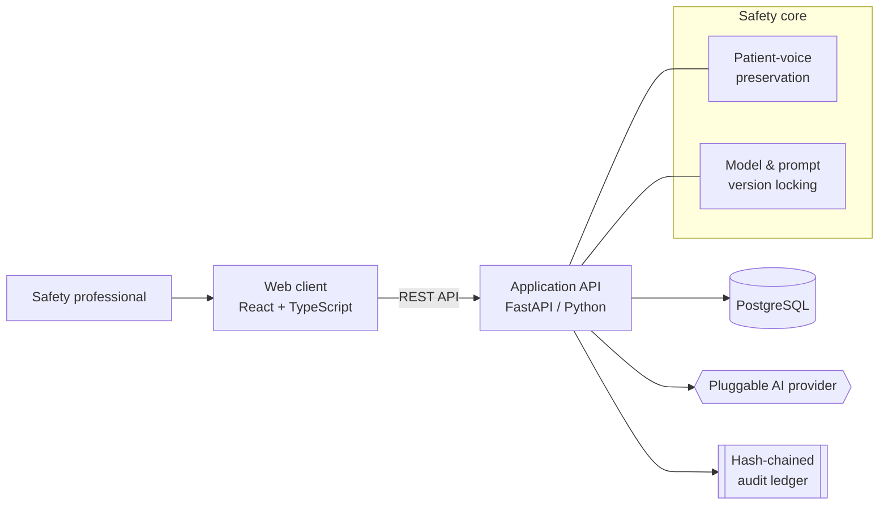

# PV Sentinel

**An AI-assisted pharmacovigilance platform built patient-first and audit-ready.**

*Draft regulator-ready adverse-event narratives faster — without losing the patient's voice or the audit trail.*

---

> **Status:** Active development. This repository is the **public overview** of PV Sentinel.
> The application source code is maintained privately during development.

---

## The problem

Pharmacovigilance (PV) — the science of monitoring drug safety — runs on a slow, manual,
and error-prone workflow:

- Writing a single adverse-event (AE) case narrative can take **2–4 hours**.
- Manual medical coding is inconsistent and error-prone.
- Established enterprise safety systems are expensive and require long, heavy deployments.
- Regulators (FDA, EMA, PMDA, Health Canada) demand complete, tamper-evident audit trails
  and reproducible records.

The result: safety teams spend disproportionate time on administrative drafting rather than
on the medical judgement that actually protects patients.

## What PV Sentinel does

PV Sentinel helps drug-safety professionals move from raw report to submission-ready case
faster, with an AI drafting assistant that **augments** — never replaces — human review:

1. **Intake** structured adverse-event case data (and the patient's own account).
2. **Draft** an ICH E2B-aligned narrative with an AI assistant.
3. **Preserve** the patient's voice and check that the AI hasn't summarised it away.
4. **Review** — a qualified human must approve or reject every AI draft.
5. **Audit** — every action is written to a tamper-evident, append-only trail.

## What makes it different

Most tools in this space optimise for feature breadth. PV Sentinel optimises for the two
things that actually matter to patients and regulators: **trust** and **traceability**.

| Principle | What it means in practice |
| --- | --- |
| 🗣️ **Patient-voice preservation** | The patient's own words are stored verbatim and immutably. Every AI narrative is checked for how much of that original voice survived — low fidelity forces human review. |
| 🔒 **Reproducible AI** | Every AI generation is locked to a cryptographic fingerprint of the exact model and prompt used, so any output can be reproduced and explained later. |
| 🧾 **Tamper-evident audit trail** | Actions are recorded in an append-only, hash-chained ledger; altering any historical record is detectable — built with 21 CFR Part 11 expectations in mind. |
| 🤝 **Human-in-the-loop by design** | AI never auto-approves anything. Narratives are always gated behind a named reviewer. |
| 🎯 **Honest AI** | No fabricated "accuracy" or "confidence" scores. If the AI can't help, it says so clearly rather than inventing content. |
| 🔓 **No vendor lock-in** | Designed for portable deployment (cloud or on-premises) with pluggable authentication. |

## Inside the review workspace

Every AI draft lands in a review screen designed so a qualified reviewer can trust it at a
glance — and prove that trust later:

- **Side-by-side change view** — see exactly what the AI drafted versus what the reviewer edited before approval.
- **The patient's own words, in view** — the verbatim account sits alongside the draft, with automatic alerts when too little of the patient's voice survives.
- **Reproducibility panel** — the exact model and prompt fingerprint behind each narrative, so any output can be explained and reproduced.
- **Per-case history** — the complete, hash-chained trail of everything that happened to that case, from intake through review.

## Who it's for

- **PV / Safety Officers & Medical Reviewers** — faster drafting, consistent structure.
- **Regulatory Affairs** — submission-ready records and complete audit trails.
- **Quality & Validation** — reproducibility and inspection-readiness.
- **Data Privacy / Governance** — patient data handled with care by design.

## Architecture at a glance

PV Sentinel is a modern web application with a clear separation between a Python API
(where the safety-critical logic and AI live) and a TypeScript web client.

### Technology stack

| Layer | Technology |
| --- | --- |
| **Frontend** | React + TypeScript (Vite) |
| **Backend / API** | FastAPI (Python), SQLAlchemy |
| **Database** | PostgreSQL (production), SQLite (local dev) |
| **AI** | Provider-agnostic large language models (initially Anthropic Claude) |
| **Compliance foundations** | Hash-chained audit trail, model/prompt hash-locking, role-based access control |

### Design principles

- **Patient safety is a hard constraint, not a feature flag.**
- **Every AI output must be reproducible and reviewable.**
- **Scope discipline:** ship a validated core before breadth.
- **Secrets never live in the codebase; auth is pluggable and portable.**

## Roadmap

**Now — MVP core**
- Case intake with verbatim patient-account capture
- AI-assisted, voice-preserving narrative drafting
- Mandatory human review workflow
- Reviewer workspace: draft-vs-edit change view, inline patient voice, reproducibility panel, per-case history
- Tamper-evident audit trail + role-based access

**Next**
- E2B(R3) structured export for regulatory submission
- MedDRA-based medical coding *(subject to dictionary licensing)*
- Expanded regulatory authority support

**Later**
- Multi-tenant / CRO capabilities
- Additional integrations (EDC, EHR) and analytics

## Important disclaimers

- **Not a medical device.** PV Sentinel is a drafting and workflow assistant, not an
  autonomous clinical decision-making system.
- **Human oversight is required.** All AI-generated content must be reviewed and approved
  by qualified professionals before any regulatory use.
- **Validation required.** Formal computer-system validation (IQ/OQ/PQ) must be completed
  before use in a regulated production environment.

## Contact

For collaboration, pilot, or investment enquiries, please reach out via the repository
owner's profile.

---

PV Sentinel — because the fastest safety narrative is worthless if it loses the patient.

